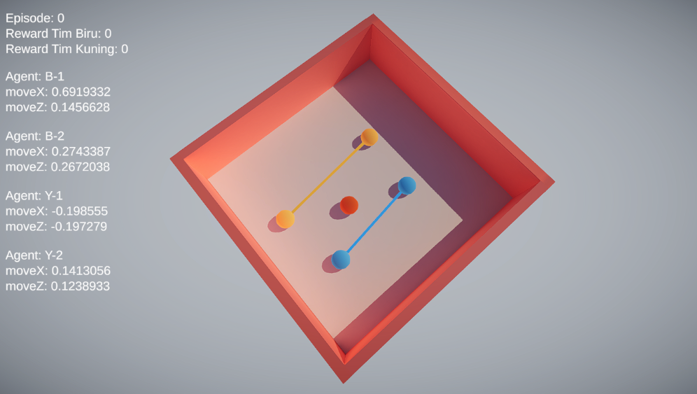
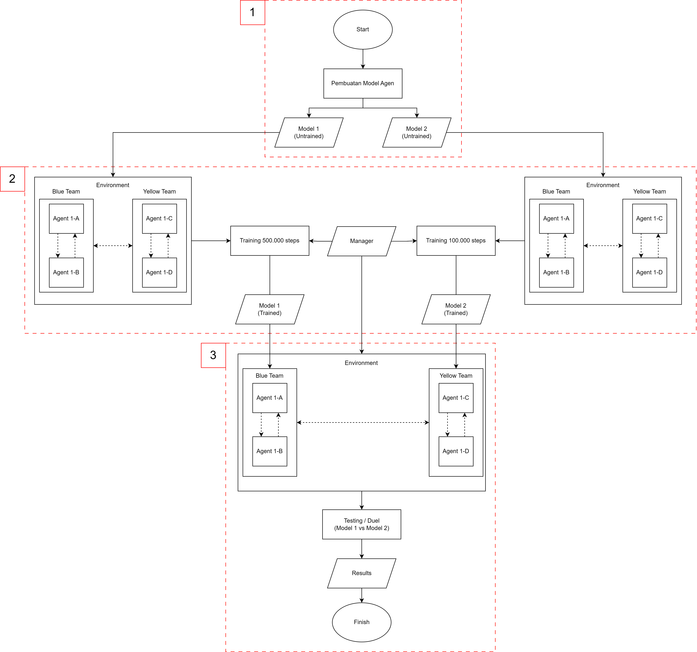

# Team-Based Competitive Multi Agent System
Sistem yang melakukan interaksi antara satu agen dengan agen lainnya menggunakan reinforcement learning (MLAgents Unity). Buku panduan ada di file bernama "Manual_Guide.pdf" dan bisa didownload di bagian release v1.0.

# Fitur Utama
1. Dua buah tim yaitu kuning dan biru
2. Sistem kolaborasi terjadi dalam satu tim (interaksi terjadi pada agen dalam satu tim)
3. Sistem kompetisi terjadi dalam dua tim (interaksi terjadi antar semua agen)
4. Sistem hukuman (punishment)
5. Reinforcement learning based

# Arsitektur / Flow-Chart secara keseluruhan
Berikut adalah gambar arsitektur dari simulasi yang telah dibuat:

